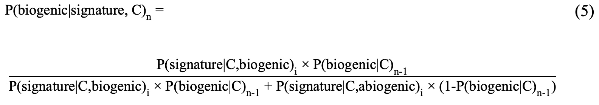

# Biosignatures
Global Sensitivity Analysis on Bayesian Inference for in situ Biosignatures

# Description

This R project computes the first and second order Sobol' indices for a Bayesian statistical model developed in my Master's thesis
on the basis of `Catling et al. 2018` (full reference below).

The statistical model is based on the iterative Bayesian inference below:

The Sobol' method is an advanced variance-based sensitivity analysis technique to quantify the interactions between a model\
variables. For more information about the Sobol' method see `https://en.wikipedia.org/wiki/Variance-based_sensitivity_analysis`.

# Codes

The codes folder contains:
* (1) `GSA_Catling.R`: implementation of two functions
  * `Catling_multipleTest()` that computes the iterative model displayed above for 15 iterations (default parameter)
  * `Sobol_index()` that computes the Sobol' indices for the model displayed above using the `sobolSalt` method from the R `sensitivity` package.

* (2) `main.R`: computes the Sobol' indices using `Sobol_index()` and displays the 1st (and 2nd) order indices on stacked polygon plots (example below).

# References

Catling, D. C., Krissansen-Totton, J., Kiang, N. Y., Crisp, D., Robinson, T. D., DasSarma, S., ... & Domagal-Goldman, S. (2018). Exoplanet biosignatures: a framework for their assessment. Astrobiology, 18(6), 709-738.

Sobol, I. M., & Levitan, Y. L. (1999). On the use of variance reducing multipliers in Monte Carlo computations of a global sensitivity index. Computer Physics Communications, 117(1), 52-61.

# Credits 

Please cite this work as follows:
Hartz, J. (2021). Quantitative framework for astrobiology strategies and in situ biogenic assessments (In prep) 
       
